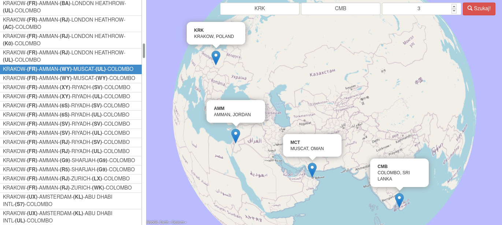
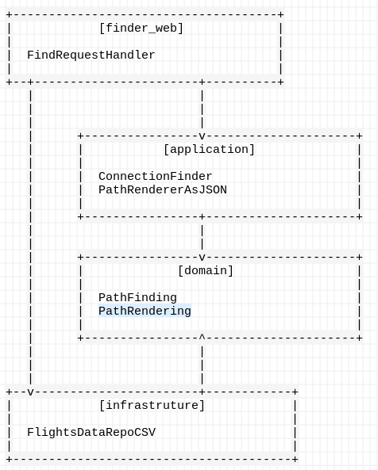
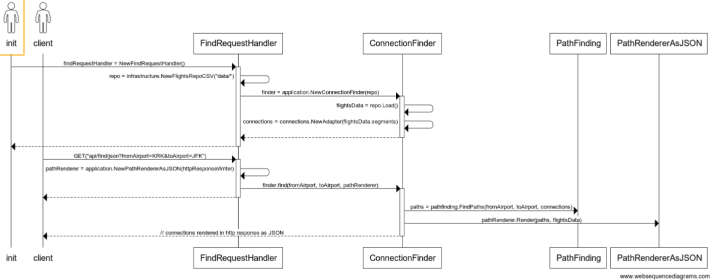

# Flight Finder

Find flight connections between two given airports.  
Using OpenAPI3 + go-gin-server generator.  
Using gin-gonic web framework.

## Run locally

```bash
docker build . -t mateuszmidor/flight-finder:latest
docker run --rm --name=flight-finder -p=8080:80 mateuszmidor/flight-finder:latest
```

## Run locally as systemd service

```bash
sudo cp init/flight-finder.service /etc/systemd/system/
sudo systemctl daemon-reload 
sudo systemctl enable flight-finder
sudo systemctl start flight-finder
sudo systemctl status flight-finder
```

## Run on AWS EC2 or similar

```bash
#!/usr/bin/env bash

# install docker
curl -fsSL https://get.docker.com | sh

# install systemd service
cat << EOF > /etc/systemd/system/flight-finder.service
[Unit] 
Description=Flight Finder Web Server 
After=network.target 

[Service] 
Type=simple 
Restart=always  
ExecStart=docker run --rm --name=flight-finder -p=80:80 mateuszmidor/flight-finder:latest
ExecStop=docker stop flight-finder 
                                   
[Install] 
WantedBy=multi-user.target
EOF

# run systemd service
systemctl daemon-reload    
systemctl enable flight-finder
systemctl start flight-finder
systemctl status flight-finder
```

## Run on AWS BeanStalk

What BeanStalk does with your code uploaded as ZIP archive:
- unzip the archive files
- `go build application.go && ./application`
- expose the application on port 5000

## Showcase

### 2-segments connection: Kraków-Las Palmas


### 3-segments connection: Kraków-Colombo




## Design

## Structure



## Sequence

