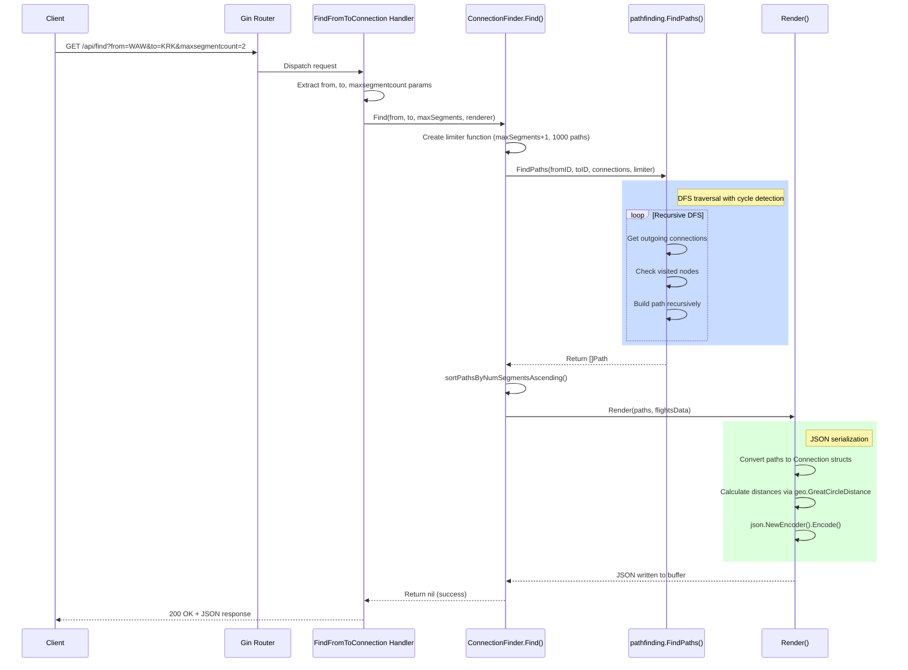

# Flight Connection Finding - Sequence Diagram

```mermaid
sequenceDiagram
    participant Client
    participant GinRouter as Gin Router
    participant FindFromToConnection as FindFromToConnection Handler
    participant ConnectionFinder as ConnectionFinder.Find()
    participant PathFinder as pathfinding.FindPaths()
    participant PathRendererAsJSON as Render()

    Client->>GinRouter: GET /api/find?from=WAW&to=KRK&maxsegmentcount=2
    GinRouter->>FindFromToConnection: Dispatch request
    FindFromToConnection->>FindFromToConnection: Extract from, to, maxsegmentcount params
    FindFromToConnection->>ConnectionFinder: Find(from, to, maxSegments, renderer)


    ConnectionFinder->>ConnectionFinder: Create limiter function (maxSegments+1, 1000 paths)
    ConnectionFinder->>PathFinder: FindPaths(fromID, toID, connections, limiter)

    rect rgb(200, 220, 255)
        note right of PathFinder: DFS traversal with cycle detection
        loop Recursive DFS
            PathFinder->>PathFinder: Get outgoing connections
            PathFinder->>PathFinder: Check visited nodes
            PathFinder->>PathFinder: Build path recursively
        end
    end

    PathFinder-->>ConnectionFinder: Return []Path
    ConnectionFinder->>ConnectionFinder: sortPathsByNumSegmentsAscending()
    ConnectionFinder->>PathRendererAsJSON: Render(paths, flightsData)

    rect rgb(220, 255, 220)
        note right of PathRendererAsJSON: JSON serialization
        PathRendererAsJSON->>PathRendererAsJSON: Convert paths to Connection structs
        PathRendererAsJSON->>PathRendererAsJSON: Calculate distances via geo.GreatCircleDistance
        PathRendererAsJSON->>PathRendererAsJSON: json.NewEncoder().Encode()
    end

    PathRendererAsJSON-->>ConnectionFinder: JSON written to buffer
    ConnectionFinder-->>FindFromToConnection: Return nil (success)
    FindFromToConnection-->>Client: 200 OK + JSON response
```
